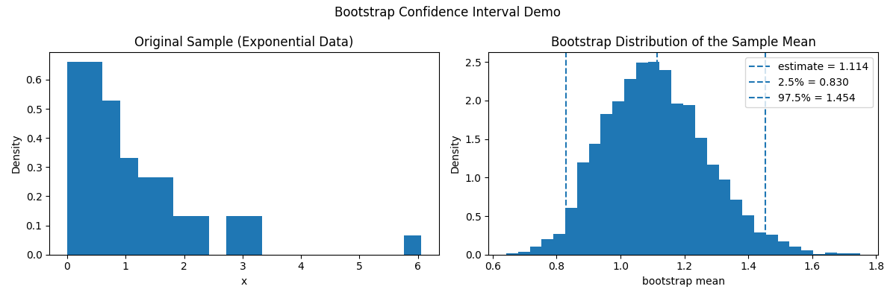

# Bootstrap Confidence Interval Demo

This demo illustrates how **bootstrap resampling** can be used to approximate
the sampling distribution of an estimator and construct a confidence interval.

## Idea

We start with a sample drawn from a non-normal distribution.
Since the true population distribution is unknown, we replace it with the
empirical distribution of the sample and repeatedly resample from it.

For each bootstrap sample, we compute the sample mean.
The resulting bootstrap statistics approximate the sampling distribution
of the estimator.

## Run

## Result


```bash
python bootstrap_ci_demo.py
